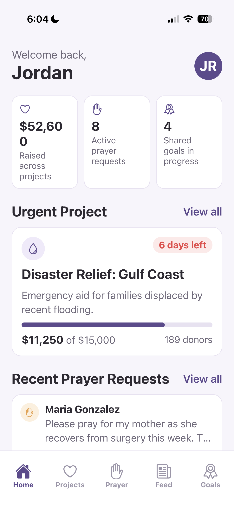
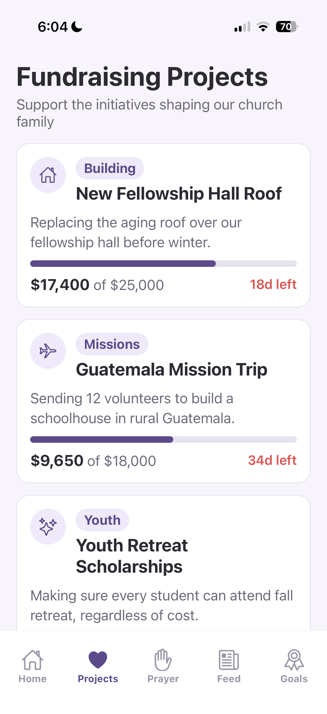
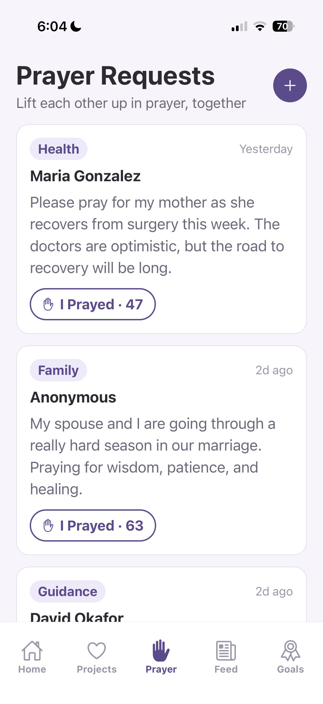
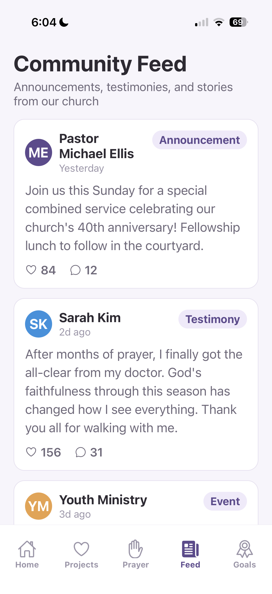
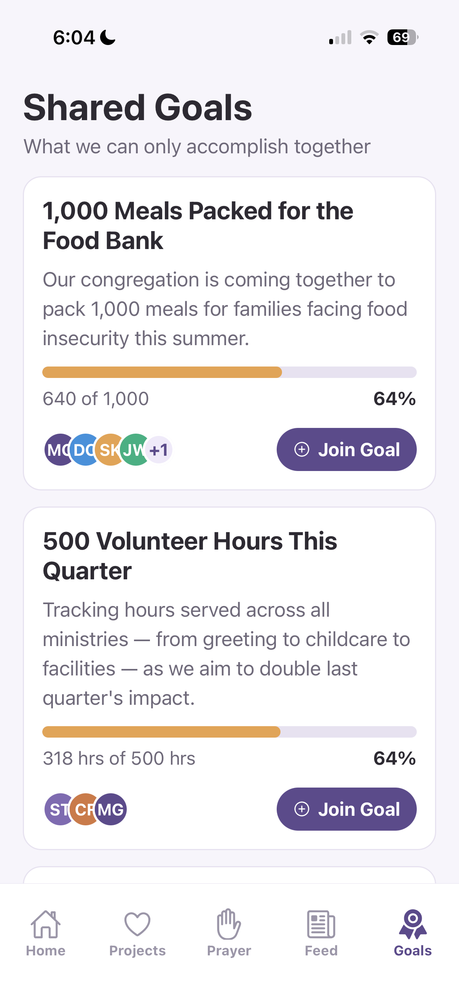
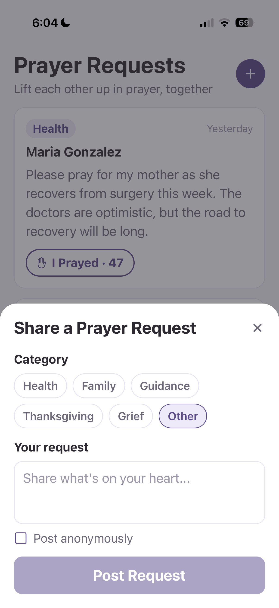

# Community Impact Platform

A mobile app that brings fundraising, prayer requests, announcements, and community goals for churches and nonprofits into one place, instead of scattered across text threads, Facebook, and a separate donation site.

Built with Expo, React Native, and TypeScript.

## Why This Project Exists

I spent over two years serving in my church's children's ministry — Sunday services, Wednesday Bible studies, events — the last six to eight months of it unpaid, because I believed in what we were doing.

What I noticed from the inside wasn't a lack of care. It was a lack of connective tissue. Prayer requests got passed around by text. Fundraising campaigns lived on a separate donation platform. Announcements went out over email, the bulletin, and Facebook, none of them in sync. Every one of those tools worked fine on its own. They just didn't talk to each other, and it was usually a volunteer who ended up filling that gap.

This project is my attempt to close that gap — one app for the things a congregation actually does together, so less time goes into managing tools and more goes into the mission itself.

I'm not trying to replace what actually makes a church community work — the relationships, the people checking in on each other, the volunteers showing up week after week. I just think the people doing that work deserve better tools than a group text and a spreadsheet.

## App Preview

| Home | Projects | Prayer Requests |
| --- | --- | --- |
|  |  |  |

| Community Feed | Shared Goals | Add a Prayer Request |
| --- | --- | --- |
|  |  |  |

## The Problem

Churches and nonprofits typically stitch together several disconnected tools to run day-to-day community life: a donation platform for fundraising, group texts or social media for prayer requests, email or a printed bulletin for announcements, and word of mouth for volunteer coordination.

Each tool does its one job adequately. None of them share context. The result:

- Supporters give to a campaign but rarely see what their donation actually funded afterward.
- Prayer requests and announcements exist in whichever app someone happened to check that week.
- Volunteers and staff spend time re-posting the same update in three places instead of once.
- There's no single view of what the community is working toward together, only isolated campaigns and posts.

None of this is a failure of effort. There's just no single place for people to stay connected to what the church is doing between Sundays.

## The Solution

Community Impact Platform puts fundraising, prayer, announcements, and shared goals in one app instead of four. A supporter can check a project's progress, post a prayer request, read the week's announcements, and see how a community-wide goal is tracking, all without switching tools or wondering which platform has the current information.

The thing I kept coming back to while building this: a donation shouldn't be the end of the story. Someone who gives to a building fund should be able to come back and see the update about the roof going up, not just a receipt.

## Key Features

- **Home Dashboard** — quick stats plus live previews of prayer requests, feed activity, and shared goals
- **Projects** — fundraising campaigns with real-time progress bars, categories, and days remaining
- **Project Details** — full campaign view with a donation flow, organizer updates, and native share
- **Prayer Requests** — post a request (anonymously if you choose), tag it by category, and mark that you've prayed
- **Community Feed** — announcements, testimonies, and event posts, with likes and comments
- **Shared Goals** — community-wide goals with per-contributor avatars and progress tracking

## Tech Stack

- **Expo (SDK 54)** + **React Native 0.81** + **TypeScript** in strict mode
- **React Navigation** — bottom tabs for the main sections, a native stack for drill-in screens like project details
- **Local component library** — `ProgressBar`, `Badge`, `Avatar`, `PrimaryButton` shared across every screen instead of one-off styling per view
- Local mock data and in-memory state only — no backend, no real payments, by design at this stage

## Development Workflow

I started with the data model before touching any screen: `Project`, `PrayerRequest`, `FeedPost`, and `SharedGoal` are all defined as TypeScript interfaces first. That decision is why the donation flow, the prayer counter, and the like/comment state on the feed all behave the same way instead of each screen reinventing its own version of "a thing with a count that changes."

Every feature here — what the feed shows, how anonymity works on a prayer request, what a "shared goal" even is — started as a decision I made, then built and refined myself. I used Claude Code the way I'd use any tool in my workflow: to move faster through repetitive screen-building, troubleshoot a stubborn error, or think through a couple of approaches before picking one. It helped me build faster. It didn't make the product decisions — I did.

## Current Status

This is an **MVP** built to validate the product concept and the user experience before investing in backend infrastructure. Every screen is fully interactive; all data is local mock data and in-memory state, so the core workflows can be explored without a server.

### Current Implementation

- Interactive mobile interface built with Expo and React Native
- Local state management across all five feature areas
- Mock fundraising campaigns with a simulated donation flow
- Prayer request creation, categorization, and interaction
- Community feed with likes and comments
- Shared goals with contributor tracking

### Roadmap

Rough order of what's next, each step chosen to unblock the one after it:

1. **Backend + auth** — Supabase or Firebase for persistent accounts and real data, replacing the mock data layer
2. **Real payments** — Stripe integration for the donation flow, replacing the demo "Give" button
3. **Push notifications** — for new prayer requests, campaign milestones, and announcements
4. **Organization admin view** — a way for church/nonprofit staff to post updates and manage campaigns without going through app code
5. **Volunteer coordination** — scheduling and sign-ups, the piece I watched cost the most informal effort as a volunteer myself

## What I Learned

The hardest part wasn't any single screen — it was noticing that a lot of screens needed the same kind of thing to work well. A prayer request's "I Prayed" count, a feed post's like count, and a project's donor count are all the same shape — a number a user bumps up once — but I didn't see that until I'd already built the first two separately. Pulling that into shared components (`Badge`, `ProgressBar`) after the fact taught me to look for that kind of repetition earlier next time, instead of copying the same logic across three screens.

I also learned to resist adding a backend before the UX was worth building one for. It would have been easy to start with Firebase and authentication in week one. Building the whole interaction model on mock data first meant every product decision — what a "shared goal" is, whether prayer requests need categories, how anonymity should work — got tested against a real UI before it became a database schema I'd have to migrate later.

## Future Vision

Long term, I want to bring AI into this in ways that actually take work off people's plates, not as a headline feature, but as quiet help in the background. Turning a coordinator's rough notes into a clean weekly announcement. Grouping similar prayer requests so a prayer team isn't reading the same need worded five different ways. Pulling together a short recap of a project's updates so donors don't have to piece it together themselves.

None of that exists yet — the near-term priority is a real backend and real payments. But it's aimed at the same goal as the rest of this app: give the volunteers and staff doing this work back some of their time, so more of it goes to the people they're serving and less of it goes to admin.

## Getting Started

```bash
npm install
npm start
```

Then scan the QR code with Expo Go, or press `a` / `i` in the terminal for an emulator/simulator.

## License

This project is not currently licensed for reuse. All rights reserved.
